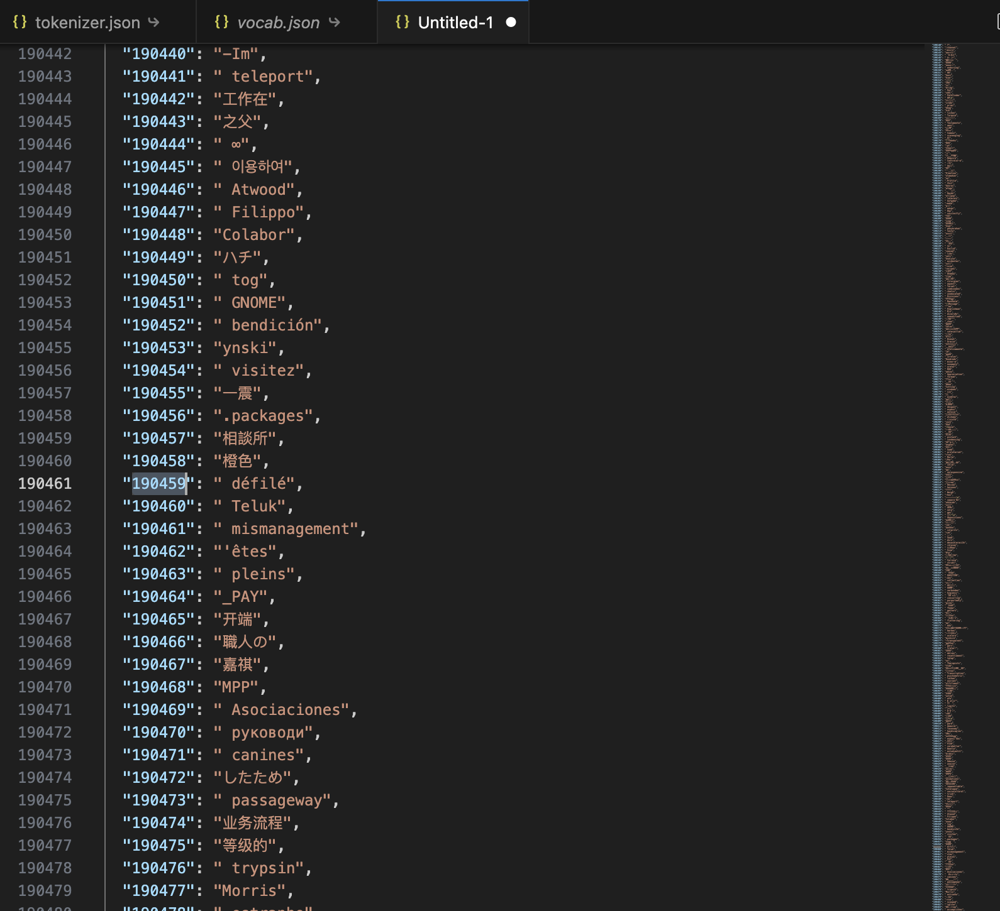
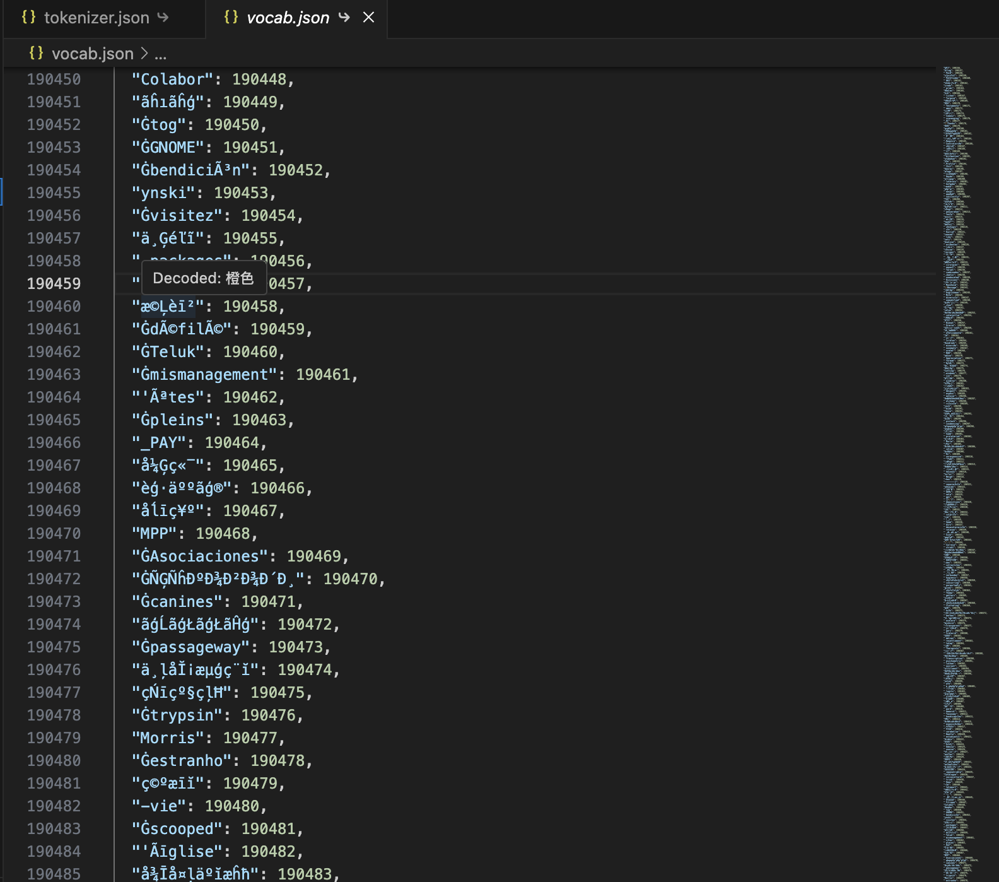

# GPT-2 Vocab Viewer

Decode GPT-2 byte-level BPE tokens inside `vocab.json` and `tokenizer.json` files.

## Features

- Command: **GPT-2 Vocab Viewer: Open Decoded Vocab**
  - Opens a read-only JSON view mapping `id -> decoded_text`.

- Hover: When you hover a string token in JSON, shows decoded text.

## Usage

1. Open a `vocab.json` or `tokenizer.json` file.
2. Run the command from the Command Palette:
   - `GPT-2 Vocab Viewer: Open Decoded Vocab`
3. Hover any token string to see the decoded text.

## Development

### Run locally

1. `npm install`
2. `npm run compile`
3. Press `F5` to launch the Extension Development Host.

### Package

1. `npm i -g @vscode/vsce`
2. `vsce package`
3. Install the generated `.vsix` via **Extensions: Install from VSIX...**

## Marketplace

After publishing, install from the VSCode Marketplace by searching for:

- `GPT-2 Vocab Viewer`

## Notes

- This implements the GPT-2 `bytes_to_unicode` mapping used by byte-level BPE.
- The decoded view is computed in-memory and not written to disk.
